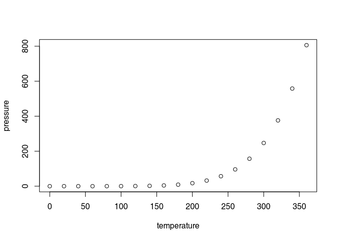

<!-- README.md is generated from README.Rmd. Please edit that file -->

# myrpackage

<!-- badges: start -->

[](https://lifecycle.r-lib.org/articles/stages.html#experimental)
<!-- badges: end -->

The goal of this R package is to …

## Wichtige Schritte zum Start

1.  Klicke im Template unter
    <https://statdm.ji.ktzh.ch:8788/stat-packages/r_package_template>
    auf „Dieses Template verwenden“.

2.  Wähle als Besitzer „stat-packages“ und gib einen Repository-Namen
    ein (nur Buchstaben erlaubt). Wähle im Bereich „Template-Elemente“
    die Option „Git Inhalt (Standardbranch)“ und klicke anschliessend
    auf „Repository erstellen“.

3.  Klone das neu erstellte Paket-Repository (siehe Anleitung:
    <https://confluence.ji.zh.ch/spaces/R/pages/844600689/Git+und+Version+Control>).

4.  Öffne im geklonten Repository die Datei `DESCRIPTION` und passe in
    der ersten Zeile den Paketnamen an. Speichere die Datei
    anschliessend.

5.  Öffne im Ordner `tests` die Datei `testthat.R`. Ersetze in Zeile 10
    und Zeile 12 den alten Namen: myrpackage, durch den neuen Paketnamen
    und speichere die Datei.

- Beispiel für Schritt 4 und 5:
  <https://statdm.ji.ktzh.ch:8788/stat-packages/statRenv/commit/2348146121b1e3614bf7d59c735ed578819c19f6>

6.  Nach erfolgreicher Anpassung kann im Environment Panel unter „Build“
    auf „Check“ geklickt werden. Die Prüfung sollte nun ohne Fehler
    durchlaufen.

## Installation

You can install this package like so:

``` r
# ADJUST THIS! HOW CAN PEOPLE INSTALL YOUR PACKAGE?
install.packages("myrpackage")
```

## Example

This is a basic example which shows you how to solve a common problem:

``` r
library(myrpackage)
## basic example code
```

What is special about using `README.Rmd` instead of just `README.md`?
You can include R chunks like so:

``` r
summary(cars)
#>      speed           dist       
#>  Min.   : 4.0   Min.   :  2.00  
#>  1st Qu.:12.0   1st Qu.: 26.00  
#>  Median :15.0   Median : 36.00  
#>  Mean   :15.4   Mean   : 42.98  
#>  3rd Qu.:19.0   3rd Qu.: 56.00  
#>  Max.   :25.0   Max.   :120.00
```

You’ll still need to render `README.Rmd` regularly, to keep `README.md`
up-to-date. `devtools::build_readme()` is handy for this.

You can also embed plots, for example:

